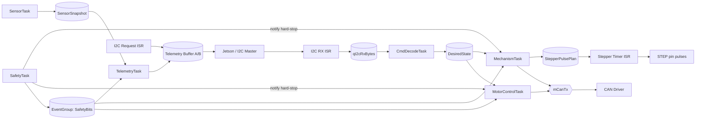
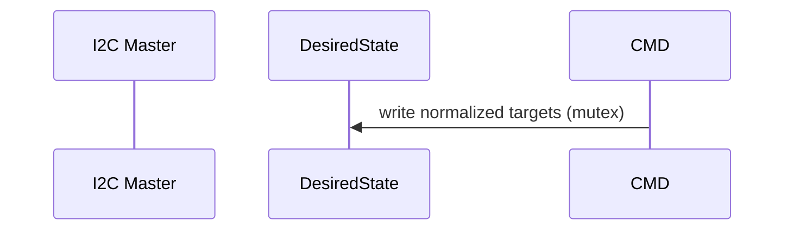
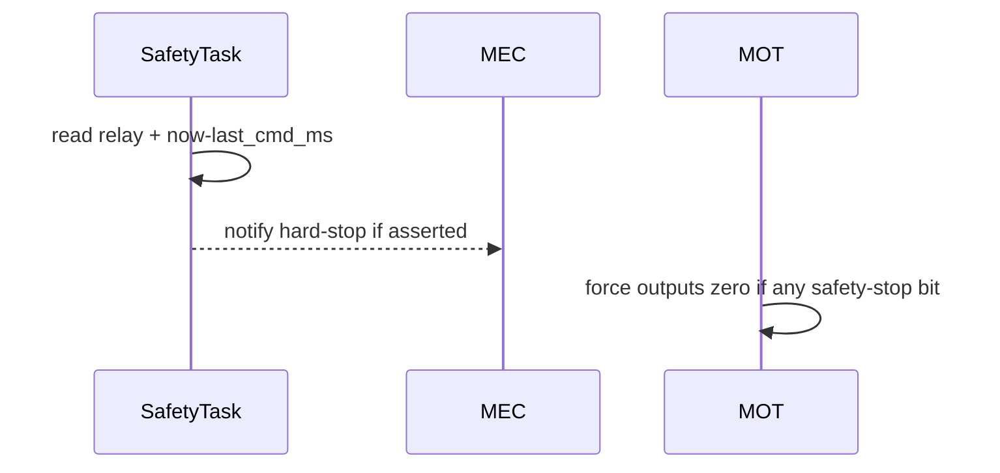
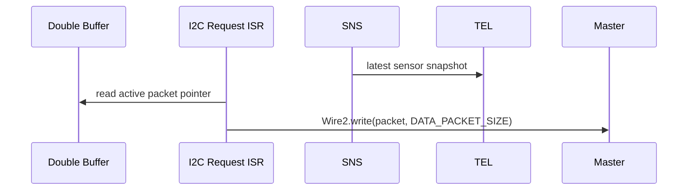

# RTOS Detailed Architecture Plan

## 1) Purpose

This document turns the exploration notes into a concrete implementation plan for the RTOS migration.

Primary goals:
- Use hardware timing for stepper pulse generation
- Use normalized command/state plumbing for deterministic behavior
- Keep safety decisions centralized and enforceable
- Preserve software telemetry and software e-stop command handling during hardware kill-switch e-stop

## 2) Architecture Decisions Locked In

1. Stepper pulse timing is moved to hardware timer ISR (not loop cadence).
2. I2C receive ISR stays minimal and only pushes bytes to queue.
3. Commands are decoded into normalized desired-state data (not direct module calls in ISR path).
4. Safety owns timeout detection and publishes safety bits globally.
5. Actuator tasks enforce safety bits every cycle.
6. While hardware kill-switch is active:
   - Allow `GRP_CONTROL` and `GRP_DATA`
   - Reject motion/mechanism command groups

## 3) High-Level Topology



## 4) Task Set and Scheduling

Assumption: `configMAX_PRIORITIES = 10` (0 is idle).

| Task | Priority | Trigger | Period/Block | Initial Stack (words) | Responsibility |
|---|---:|---|---|---:|---|
| `SafetyTask` | 7 | periodic | 5 ms | 512 | Relay status, timeout detection, safety bit updates, hard-stop notifications |
| `DebugTask` | 1 | periodic | 50-100 ms | 640 | Serial/Teleplot output only |

Interrupt handlers:
- I2C RX ISR: queue push only (`xQueueSendFromISR`)
- I2C Request ISR: send latest ready telemetry buffer only
- Stepper Timer ISR: pin toggling only, no RTOS API calls

## 5) RTOS Primitives

### Queues

| Name | Type | Depth | Producer | Consumer | Notes |
|---|---|---:|---|---|---|
| `qI2cRxBytes` | `uint8_t` | 32 | I2C RX ISR | `CmdDecodeTask` | Byte ingress decoupling; overflow counter for diagnostics |

### Event Group

`egSafetyBits` (written by `SafetyTask`, read by control tasks):
- `SAFETY_HW_ESTOP`
- `SAFETY_SW_ESTOP`
- `SAFETY_COMMS_TIMEOUT`
- `SAFETY_OVERCURRENT`
- `SAFETY_LATCHED_STOP` (optional if we want explicit reset semantics)

### Mutexes

| Name | Protects | Users |
|---|---|---|
| `mCanTx` | CAN peripheral transaction sequence | `MotorControlTask`, `MechanismTask` |
| `mDesiredState` | `DesiredState` struct | `CmdDecodeTask` writer, actuator task readers |

### Task Notifications

- `SafetyTask` -> `MotorControlTask`: hard-stop notification bit
- `SafetyTask` -> `MechanismTask`: hard-stop notification bit

Use notifications for low-latency stop signaling; use event bits for persistent safety state.

## 6) Shared Data Contracts

### `DesiredState`

Single source of operator intent, updated only by `CmdDecodeTask`.

```c
typedef struct {
    float loco_left_target;      // normalized -1..1 after duty scaling
    float loco_right_target;     // normalized -1..1 after duty scaling
    float excav_belt_target;     // normalized -1..1 after duty scaling
    int8_t excav_vert_dir;       // -1,0,+1
    int8_t depo_door_cmd;        // -1 close, 0 hold, +1 open
    int8_t depo_vib_cmd;         // -1,0,+1
    uint32_t last_cmd_ms;        // for timeout logic
} DesiredState;
```

### `SensorSnapshot`

Prepared by `SensorTask`, read by `TelemetryTask` and optional debug.

### `StepperPulsePlan`

Shared with timer ISR.

```c
    volatile uint8_t enabled;        // 0/1
    volatile uint8_t dir;            // 0=down, 1=up
```

## 7) Hardware-Timed Stepper Plan

Implementation strategy:
1. Configure `IntervalTimer` at boot with an ISR callback.
2. ISR toggles STEP pin each invocation if `enabled==1`.
3. `MechanismTask` updates `StepperPulsePlan` (dir/enabled/period) from desired state and limits.
4. ISR reads plan and runs without dynamic allocation, queues, or prints.

Benefits:
- Pulse quality independent of RTOS task jitter
- Cleaner mechanism task code (task makes decisions, ISR makes pulses)
- Easier to prove maximum missed-step risk

Constraints:
- Use `digitalWriteFast` or direct GPIO for ISR speed
- Keep ISR constant-time and branch-light
- Guard shared plan updates with critical section or atomic write strategy

## 8) Command Policy and Gating

Command validation is centralized in `CmdDecodeTask`. The kill-switch gating policy has been validated against the prototype and is kept as-is:

```text
if HW kill-switch estop active:
  allow groups: CONTROL, DATA
  reject groups: locomotion, excavation, deposition
else:
  allow all valid groups
```

SW can still send software e-stop/reset semantics. Actuator-changing commands are blocked while hardware e-stop is active.

For any multi-byte command extension, axis/register mapping must be defined explicitly in named constants before field deployment. Parser tests covering both axis variants are required before any multi-byte extension ships. This was a source of ambiguity in the prototype and is a hard guardrail going forward.

## 9) Control Flow Sequences







## 10) Safety State Ownership

Single-writer policy:
- `SafetyTask` is the only writer of `egSafetyBits`.

Consumers:
- `CmdDecodeTask` reads for command gating.
- `MotorControlTask` and `MechanismTask` read for enforcement.
- `TelemetryTask` reads for packet flags.

This avoids conflicting stop logic spread across multiple modules.

The low-latency task notification path from `SafetyTask` to actuator tasks is kept in addition to the persistent event bits — the notification handles the immediate hard-stop response, the bits handle steady-state enforcement. Both are required.

## 11) File/Module Layout (Planned)

```text
RDT_25_26_RTOS/
  include/
    rtos_types.h
    rtos_config.h
    safety_bits.h
  src/
    main.cpp
    rtos/
      app_init.cpp
      isr_i2c.cpp
      isr_stepper_timer.cpp
      task_safety.cpp
      task_cmd_decode.cpp
      task_motor_control.cpp
      task_mechanism.cpp
      task_sensor.cpp
      task_telemetry.cpp
      task_debug.cpp
      shared_state.cpp
```

## 12) Step-by-Step Implementation Plan

### Phase A: Kernel scaffold
- Add FreeRTOS lib dependency
- Create task skeletons and all RTOS primitives
- Keep outputs disabled by default

### Phase B: Safety backbone
- Implement `SafetyTask` + safety event bits
- Add hard-stop notification path to control tasks
- Add counters for transitions and timeout events

### Phase C: Command plumbing
- Add RX ISR queue and `CmdDecodeTask`
- Implement normalized `DesiredState`
- Implement command gating rules for kill-switch mode
- Define all multi-byte command axis/register mappings as named constants at this phase; do not defer

### Phase D: Actuator control tasks
- Move locomotion/excav belt CAN logic into `MotorControlTask` (20 ms)
- Move deposition + stepper control decisions into `MechanismTask` (5 ms)
- Introduce hardware timer ISR for stepper pulse generation

### Phase E: Sensors and telemetry
- Add `SensorTask` snapshot generation
- Add `TelemetryTask` packet build + double buffer
- Keep I2C request ISR minimal and deterministic
- Keep legacy telemetry packet compatibility for parent bring-up tools
- Add explicit byte-count assertions for every serialized `GRP_DATA` register; these must be verified against the active superloop serializer, not assumed

### Phase F: Debug and tuning
- Add debug task
- Enable stack high-water mark and heap monitoring behind a debug flag during migration; remove or gate behind flag before competition build
- Tune queue depths, task stacks, and periods using measured runtime

## 13) Acceptance Criteria

1. With kill-switch e-stop active:
   - Data request responses continue at expected packet length
   - `GRP_CONTROL` accepted
   - Motion/mechanism command groups rejected

2. Timeout behavior:
   - No command for `COMMAND_TIMEOUT_MS` sets timeout safety bit
   - Actuator outputs are forced to safe state within one control period

3. Stepper timing:
   - Pulse jitter stays bounded by timer ISR, independent of command burst load

4. Stability:
   - No queue overflows in normal command rate
   - If overflow occurs, system remains safe and counters expose fault

5. Parent compatibility:
   - `i2c_parent` command keys (`WASD`, excavation, deposition, stop, estop) operate the RTOS child without protocol remapping
   - Legacy data request path returns expected packet length for current bench scripts; this must be verified with an explicit test that sends a `GRP_DATA` request and checks the response byte count

6. Pin parity:
   - Child pin assignments for relay, current mux, encoders, stepper, deposition door, and vib motor match the active superloop `pins.h` unless explicitly documented as variant-only
   - Migration acceptance includes a cross-check against the active superloop pin map; undocumented divergences are a blocking failure

7. Protocol robustness:
   - Multi-byte command extensions include explicit axis/register mapping constants
   - Serializer outputs are verified against expected byte lengths per register; encode/decode round-trip checks are required for all bit-packed telemetry fields

## 14) Instrumentation to Add Early

- `i2c_rx_overflow_count`
- `cmd_rejected_killswitch_count`
- `cmd_decode_invalid_count`
- `timeout_event_count`
- `safety_transition_count`
- `max_task_exec_us` per critical task
- `telemetry_serialize_error_count`
- `i2c_response_short_packet_count`

These make bring-up and competition debugging much faster.